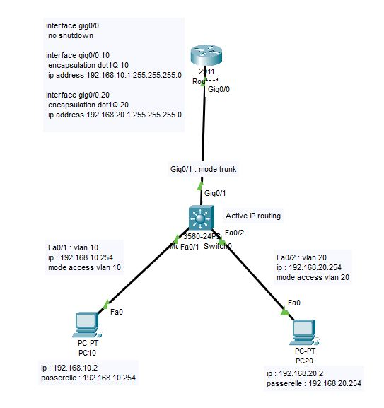

# Parametrer un switch
## Accés au Switch 
Les Commandes a Connaitre

|Commandes|Utilisation|
|:-----|:----|
|enable|Acces au mode priviligié|
|#configure terminal|Mode de configuration globale|
|#hostname <nom_du_switch>|Nommer le Switch|

## Configuration VLAN

|Commandes | Utilisation|
|:------|:-------|
|#vlan <n°duVLAN>|Creation du VLAN|
|#vlan <n°duVLAN></br>name <nom_du_vlan>|Attribue un nom au VLAN|

### Affectation des ports
Pour affecter les ports du fa0/1 a fa0/10 a un VLAN
```
#interface range fa0/1-10
#switchport mode access
#switchport access vlan <n°duVLAN>
```
## Securisation des ports
```switchport port-security```
```
#interface fa0/1
#switchport mode access
#switchport port-security
```
La commande ```switchport port-security maximum 2``` (par defaut: 1) permet de limiter le nombres d'adresses MAC autorisées sur un port

Pour activer l'apprentissage dynamique et sécuriser des adresses apprises utilisez ```switchport port-security mac-address sticky```
```
#interface fa0/1
#switchport mode access
#switchport port-security
#switchport port-security maximum 2
#switchport port-security mac-address sticky
```
Qui permet d'accepter 2 peripheriques maximum.

## Verifications et sauvegarde
* Verifications des VLANs configurés
  ```
  show vlan brief
  ```

* Examiner l'ensemble des parametres appliqués au switch
  ```
  show running-config
  ```
* Sauvegarde de la configuration
  ```
  copy running-config startup-config
  ```
* Verification que la configuration est bien enregistré
  ```
  show startup-config
  ```

## Configuration ACLs



### Sur le Routeur
```
enable
#configure terminal
#interface gig0/0
#no shutdown

#interface gig0/0.10
#encapsulation dot1Q 10
#ip address 192.168.10.1 255.255.255.0

#interface gig0/0.20
#encapsulation dot1Q 20
#ip address 192.168.20.1 255.255.255.0

--- CREATION DES ACL DE FILTRAGE ---
#ip access-list extended BLOCK_VLAN10
#deny ip 192.168.10.0 0.0.0.255 192.168.20.0 0.0.0.255
#permit ip any any
exit

#ip access-list extended BLOCK_VLAN20
#deny ip 192.168.20.0 0.0.0.255 192.168.10.0 0.0.0.255
#permit ip any any
exit
```
### sur le switch L3 "3560-24PS"
```
enable
#configure terminale

--- Activation du routage L3 ---
#ip routing

--- Creation des VLANs ---
#vlan 10
#vlan 20

--- Configuration des interfaces ---
#interface Gig0/1
#switchport mode trunk
exit

#interface Fa0/1
#ip address 192.168.10.254 255.255.255.0
#no shutdown
exit

#interface Fa0/2
#ip address 192.168.20.254 255.255.255.0
#no shutdown
exit
```

# Parametrer un routeur
## Configuration des interfaces
```
enable
#configure terminal
#interface <nom_de_l'interface>
#ip address 192.168.0.0 255.255.255.0
#no shutdown
#exit
```

## Configuration (router-on-a-stick)
```
enable
#configure terminal
#interface <nom_de_l'interface> 
#no shutdown
#interface gig 0/0.10
#encapsulation dot1q 10
#ip address <adresse_ip> <masque_SR>
```

  
## Configuration des routes
* **Route statique** : definie manuellement, ideal pour petit reseau lorsque le chemin est fixe
```ip route <destination> <masque_sous_reseau> <passerelle>```
Pour verifier la route statique ```show ip route```
Pour verifier la configuration IP des interfaces ```show ip interface brief```
Pour supprimer une route statique meme commande avec "no" ```ip route <destination> <masque_sous_reseau> <passerelle>```
Exemple pour la configuration d'un routeur
```
#enable
#configure terminal
#interface GigabitEthernet0/0
#ip address 192.168.0.1 255.255.255.0
#no shutdown
#exit
#ip route 192.168.2.1 255.255.255.0 10.0.0.2
#show ip route 
```
* **Route dynamique** : definie automatiquement la gestion des routes en fonction des changements de la topologie du reseau. Ideal pour les grands reseaux
  * Protocole RIP (Routing Information Protocol) : Basé sur le vecteur de distance, Limiter a 15 sauts, petit reseau
  * Protocole OSPF (Open Shortest Path First) : Basé sur l'etat des liens, Utilise un algo pour calculer les meilleurs chemins, configuration plus complexe
  * Protocole EIGRP (Enahanced Interior Gateway Routing Protocol) : Hybride entre RIP (vecteur de distance) et OSPF (etats des liens). Protocole Proprietaire de Cisco
```
#enable
#configure terminal
#router rip
#version 2
#network [adresse_reseau]
#network [adresse_reseau]
#exit
```
Pour verifier la table de routage ```show ip route```  
Mode debug de RIP ```debug ip rip```
