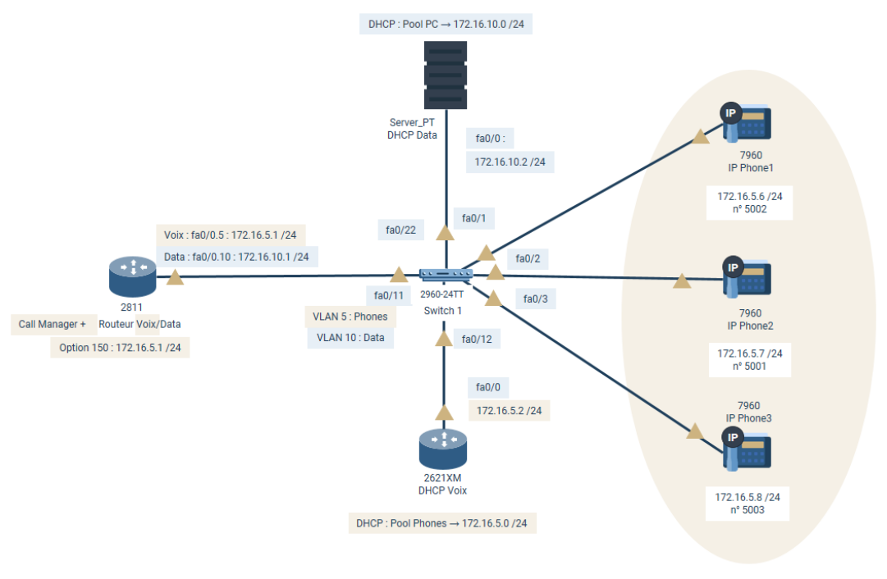

|[RETOUR](../README.md)|
|:---|



# Configuration Telephonie sur IP

**1. Configuration Router-On-a-Stick (Routeur 2811)**
```
Router(config)# interface fa0/0
Router(config-if)# no shutdown

# Sous-interface pour le VLAN 5 (Voix)
Router(config)# interface fa0/0.5
Router(config-subif)# encapsulation dot1Q 5
Router(config-subif)# ip address 172.16.5.1 255.255.255.0

# Sous-interface pour le VLAN 10 (Données)
Router(config)# interface fa0/0.10
Router(config-subif)# encapsulation dot1Q 10
Router(config-subif)# ip address 172.16.10.1 255.255.255.0
```

**2. Configuration Pool DHCP Voix (Routeur 2621XM)**

```
Router_DHCP(config)# ip dhcp excluded-address 172.16.5.1 172.16.5.5
Router_DHCP(config)# ip dhcp pool Phones
Router_DHCP-config-pool# network 172.16.5.0 255.255.255.0
Router_DHCP-config-pool# default-router 172.16.5.1
Router_DHCP-config-pool# option 150 ip 172.16.5.1  # Adresse du Call Manager(Routeur 2811)
```

**3. Configuration Switch (2960)**

```
Switch(config)# vlan 5
Switch(config-vlan)# name Phones
Switch(config)# vlan 10
Switch(config-vlan)# name Data

# Configuration du Trunk vers le routeur (2811)
Switch(config)# interface fa0/11
Switch(config-if)# switchport mode trunk

# Configuration des ports vers les téléphones IP (fa0/1 à fa0/3)
Switch(config)# interface range fa0/1 - 3
Switch(config-if)# switchport mode access
Switch(config-if)# switchport access vlan 10      # VLAN par défaut pour un PC
Switch(config-if)# switchport voice vlan 5       # VLAN dédié pour le téléphone
Switch(config-if)# spanning-tree portfast         # Accélère la connexion

# Configuration port fa0/12 vers Routeur 2621XM DHCP_Voix
Switch(config)# interface fa0/12
Switch(config-if)#switchport mode access
Switch(config-if)#switchport access vlan 5
```

**4. Configuration de la Telephonie (CME sur le 2811)**
```
Router(config)# telephony-service
Router(config-telephony)# max-dn 10
Router(config-telephony)# max-ephones 10
Router(config-telephony)# ip source-address 172.16.5.1 port 2000
Router(config-telephony)# auto assign 1 to 10

# Exemple pour le premier numéro
Router(config)# ephone-dn 1
Router(config-ephone-dn)# number 5001

Router(config)# ephone-dn 2
Router(config-ephone-dn)# number 5002

Router(config)# ephone-dn 3
Router(config-ephone-dn)# number 5003
```

---

## Commande pour verification
**Switch#** show running-config ## Voir toutes la configuration</br>
**Switch#** show vlan brief ## Pour voir les VLANs et les Interfaces

